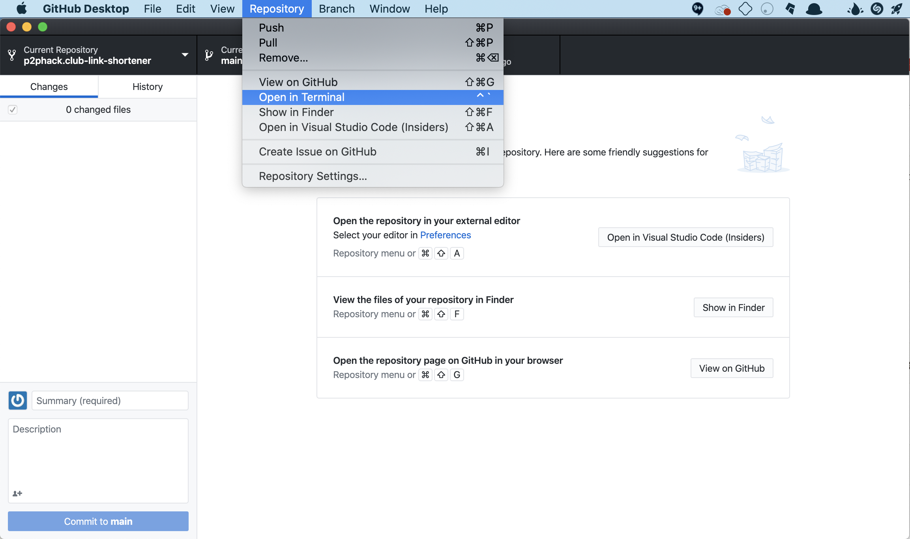

# p2phack.club-link-shortener

> [P2P Hack Club](https://p2phack.club)’s Airtable-Based Link Shortener, forked from [hack.af](https://github.com/hackclub/hack.af) by [Hack Club](https://hackclub.com/).

This repository has information and set-up instructions that is only useful to P2P Hack Club coleads. 

*[Want to make your own link shortener? Check out the template code here!](https://github.com/hackclub/hack.af)*

## Setup

1. Ensure you have access to the P2P Hack Club Link Shortener Airtable. 

2. Navigate to https://airtable.com/api, and click on the base.

    <details>
    <summary>Photo</summary>

    
    
    </details>

3. Grab the Airtable Base Key, and copy it for later.

    <details>
    <summary>Photo</summary>

    
    

    </details>

4. Grab your personal API key from your Airtable Account page at https://airtable.com/account.

    <details>
    <summary>Photo</summary>

    
    

    </details>

5. Clone the repository. There are many tools to do this, including Git and GitHub Desktop (reccomended for beginners). 
    
    <details>
    <summary>Cloning with GitHub Desktop</summary>

    * If you haven't already, [download GitHub Desktop](https://desktop.github.com/).

    * Then, click the green clone button at the top of this repository. Click "Open in Desktop".

    

    * Once GitHub Desktop opens, click "Clone". 

    

    * When it asks you how you are planning to use this fork, click "For my own purposes".

    
    
    </details>

    <details>
    <summary>Cloning with Git</summary>

    * If you haven't already, [install Git](https://git-scm.com/downloads).

    * Next, open your terminal/command prompt (cmd)/git bash.

    * Navigate to a directory that you want to clone the repository into. You can use the `cd` command to move directories, and use the `mkdir` command to create folders.
    
    * Use this command to clone the repository into your current folder:
    
        `git clone https://github.com/P2PHackClub/p2phack.club-link-shortener.git`

    </details>

6. Using your terminal, navigate to the cloned repository.

    <details>
    <summary>If you are using GitHub Desktop</summary>

    At the top of the program (or in your menu), click Repository > Open in Terminal.

    

    </details>

7. Use NPM to download project dependencies.

* If you haven't already, [download NPM](https://nodejs.org/en/download/). (NPM comes bundled with Node.js)

* Use the command `npm install` to install dependencies for the project

8. Set enviornment variables

* Create a file where the repository is located called `.env`. Inside of it, you will paste the keys that you found eariler.
    
    * Set `AIRTABLE_BASE` to your Base ID, and `AIRTABLE_KEY` to your API Key.
    * Set `LOGGING` to `on` if you want to enable logging, `off` if otherwise. We reccomend you set this to `on`.
    * Set `BOT_LOGGING` to `on` if you want to enable logging for crawlers, `off` if otherwise. We reccomend you set this to `on`.
    * Set `CACHE_EXPIRATION` to the number of seconds you want the local cache to be valid. For our links, we should aim for under 2 minutes so that we can make fast changes during club meetings.

    Here is what a sample `.env` file might look like:
    ```
    AIRTABLE_BASE=#################
    AIRTABLE_KEY=#################
    LOGGING=yes
    BOT_LOGGING=yes
    CACHE_EXPIRATION=120
    ```

    **WARNING: Never share this file with anyone, or commit it back to the repository.**

9. Now for the fun part! Use the command `node app.js` to run the program! If you want to stop it, use the shortcut CTRL+C.

TODO: Figure out how to get the rest working 😉


## Using

All links will be routed through a 302 (Temporary Redirect) because you're using Airtable. Simply visit `example.com/slug` to get redirected.

## License

This project is released under [the MIT license](LICENSE).
